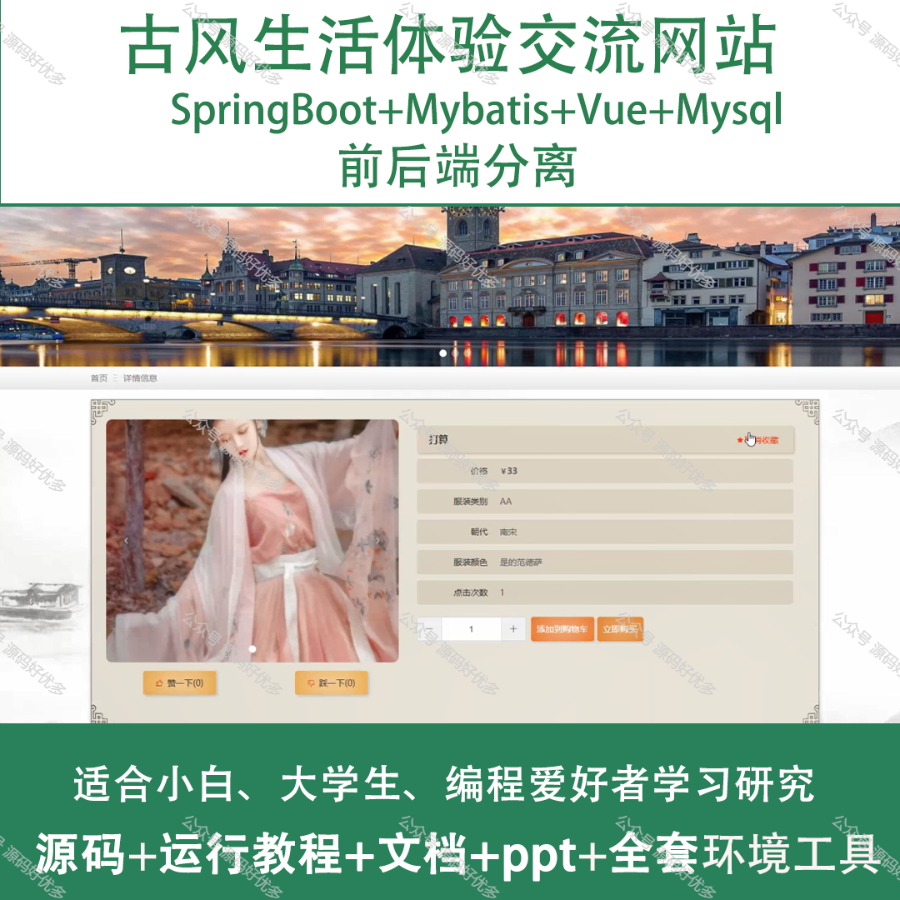
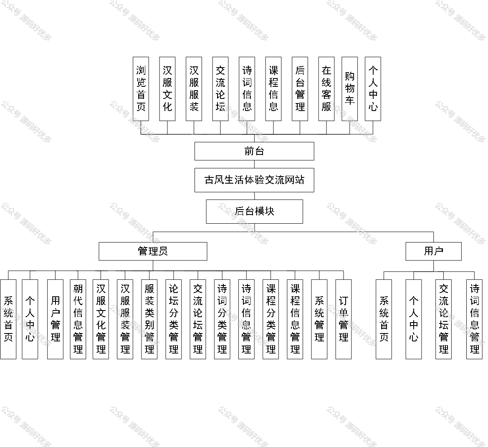
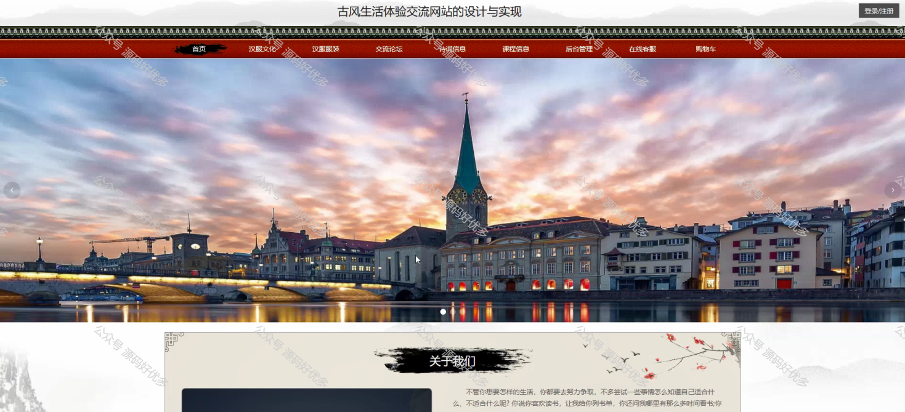
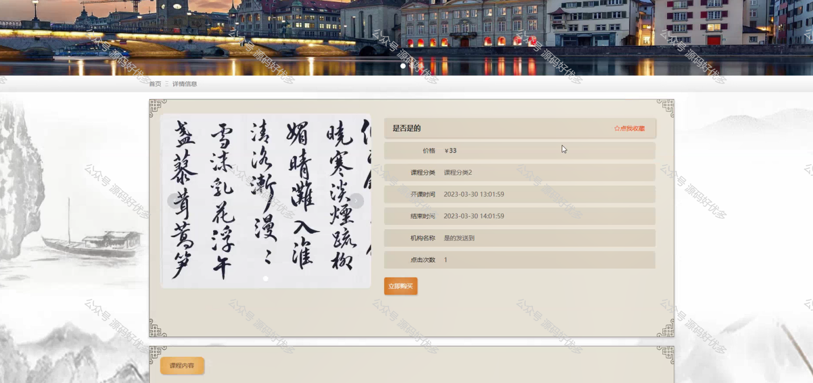
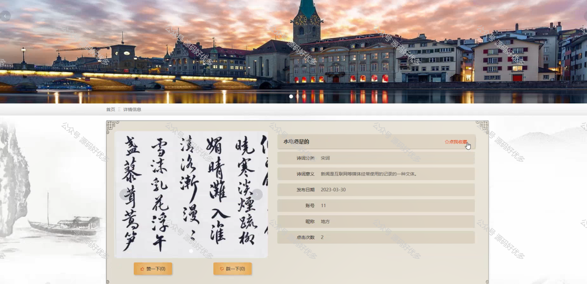
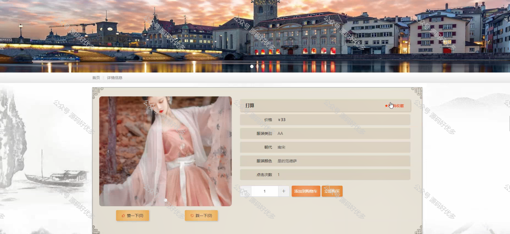
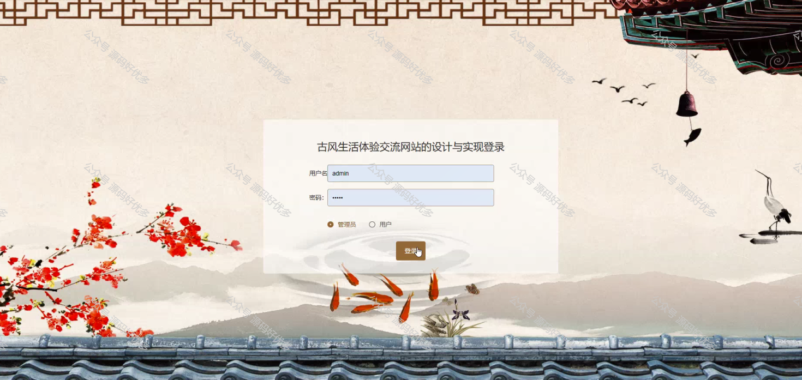
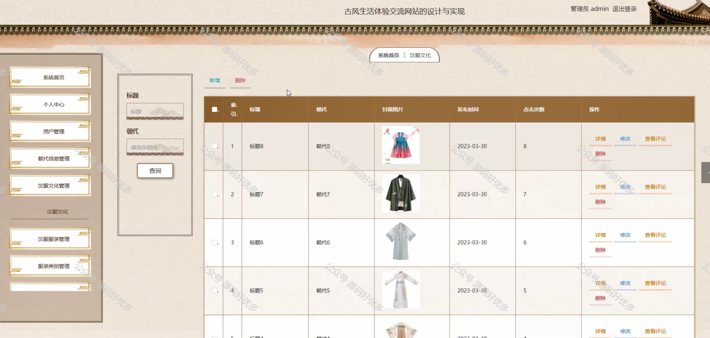
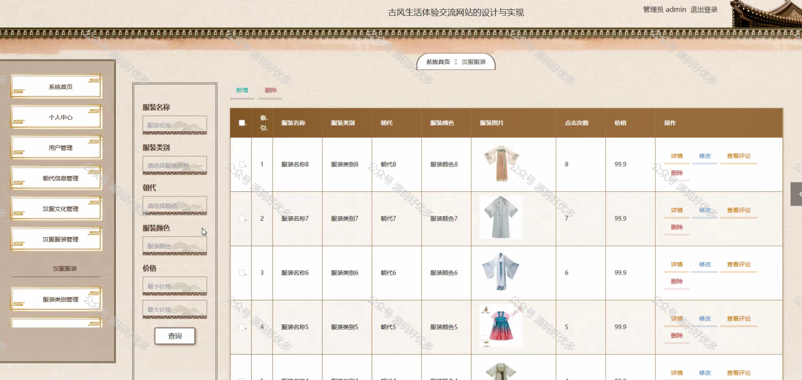
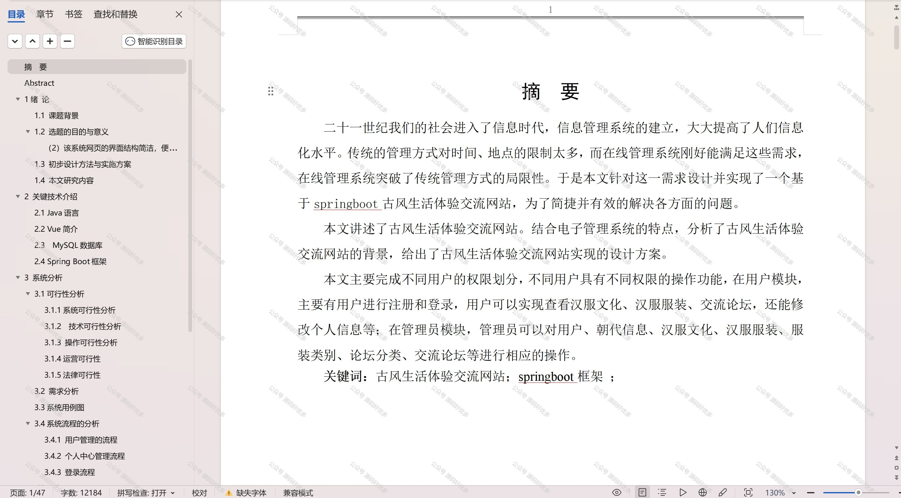

 
## 查看主页获取源码

### 一、作品包含

源码+数据库+设计文档万字+PPT+全套环境和工具资源+部署教程

### 二、项目技术

前端技术：Html、Css、Js、Vue、Element-ui

数据库：MySQL

后端技术：Java、Spring Boot、MyBatis

  

### 三、运行环境

开发工具：IDEA/eclipse

数据库：MySQL5.7

数据库管理工具：Navicat10以上版本

环境配置软件： JDK1.8+Maven3.6.3

前端Nodejs：14

### 四、项目介绍
项目编号：springbootA185

古风生活体验交流网站是一个让现代人与同好者分享和探索古风生活方式的平台，它以传承和弘扬传统文化为宗旨，汇聚了一群热爱古典美学、传统工艺和复古生活的朋友。在这里，人们可以交流汉服穿搭、古风摄影、传统茶艺、书法绘画等技艺，共同感受古代生活的雅致与韵味，寻找心灵的宁静和归属。

前台用户功能：浏览首页、汉服文化、汉服服装、交流论坛、诗词信息、课程信息、后台管理、在线客服、购物车和个人中心。

后台分为管理员和用户
管理员的功能：系统首页、个人中心、用户管理、朝代信息管理、汉服文化管理、汉服服装管理、服装类别管理、论坛分类管理、交流论坛管理、诗词分类管理、诗词信息管理、课程分类管理、课程信息管理、系统管理、订单管理。
用户的功能：系统首页、个人中心、交流论坛管理、诗词信息管理。

### 五、运行截图

  
